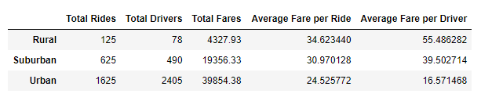

# PyBer-Analysis

## Overview/Purpose
The PyBer company is looking to analyze a large amount of data to determine what steps need to be taken to increase ridership or to make things more affordable for the customer.  To do this, they have given a csv file with data from a number of different PyBer rides.  This data includes dates, durations, cities, and types of cities.  I was able to organize the data into different dataframes and to present it using line, bar, pie, and scatter graphs.  These graphs will help give a virtualization as to which areas may need to be focused on.  

The challenge part of this project focused on finding the average fares paid by drivers living in urban, suburban, and rural areas during the first 5 months of the year 2019.

## Results
One of the data frames developed during this challenge shows the differences between fares for both the driver and rider within the different city types.  The data frame shows the following things:
  1. There were a lot more rides and drivers in the urban areas than there were in the rural or suburban areas.  This would be expected as more people live in urban areas than suburban and rural.
  2. The average fare per ride decreases as we move from rural to suburban to urban.  Urban riders pay the smallest amount (on average) for each ride.
  3. Urban drivers also receive the smallest amount of money per ride as well.  This would match up with the above description.  If people pay less per ride, the driver will get less per ride.
  4. The most interesting thing about this data is that the total drivers in the urban area is more than the total rides.  In the rural and suburban areas this is not the case.  Furthermore, the data shows as the ratio of total rides to total drivers decreases, the average price per ride goes down and the amount of money for the driver increases.   The discrepancy seems to be largest with the amount of money the driver receives.
  5. The multiple line graph that was created shows that PyBer made most of its money through the urban environment.  
  6. The number of rides given in the rural environment was 13 times smaller than those given in the urban and 5 times smaller than those given in suburbia.  If all fares were the same, we would expect the total fares to be collected to be about 13 and 5 times larger for urban and suburban regions.  The graph shows this is not the case.

DataFrame

Multiple Line Graph

## Summary
Here are three recommendations I would give to the company CEO
  1. Try to increase ridership in the urban areas to catch up to the number of drivers.  This will allow fares to increase and will make you more money.
  2. Recruit more drivers in the rural and suburban areas.  More drivers would decrease the cost per ride and would entice more people to use the service.
  3. You could also try to convince some of your urban drivers to work in the suburban or rural areas.  This would increase access and affordability in the smaller neighborhoods and would also give those drivers more of a chance to find riders.
